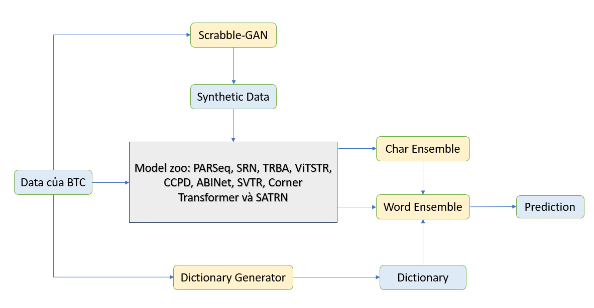

# Vietnamese Handwritten Recognition

- Tổng quan giải pháp của chúng tôi như hình dưới đây:




__NOTE__: 
- Machine with GPU support is recommended.
- Source code was written on Window operating system and models were trained on Kaggle platform. Running on Linux may encounter errors. Please inform us for proper support and debugging.

## 0. Project Structure
- The high level structure of this project :
  - `data/`: training data, public test and data synthesis are stored in this folder.
  - `scripts/`: neccessary bash scripts for training on docker container can be found in this folder. These scripts are also used for training on Kaggle platform. 
  - `saved_models/`: weights for our trained models.
  - `ensemble`: this folder stores CSV (.csv) files serve for the purpose of model ensembling.

## 1. Environment Configuration

- After unzipping the compressed source code, run the following command to build docker image:
```bash
docker build -f Dockerfile -t ai4all .
```
- Run docker container with GPU:
```bash
docker run  --runtime=nvidia --gpus 1 -it --rm --name ai4all_container --network=host ai4all bash
```

- Run docker container without GPU:
```bash
docker run -it --rm --name ai4all_container --network=host hackathon bash
```

## 2. Model Training & Inference
### 2.1. Text Recognition
#### 2.1.1. Model Training
- Our final results is obtained by ensembling different models. The list of models are: 
['model6_new_full','model5_synth_tone_full','model17_new_full','model1_full','model35_tone_full''model3_new_full','model10_synth_new_full','model1_synth_full','model5_synth_full','model4_synth_new_full','model5_synth_new_full','model15_new_full','model5_new_full','model10_full','model35_full','model19_synth_new_full','model35_synth_full','model2_synth_full','model27_full','model33_tone_full','model19_new_full','model30_tone_full','model15_full','model13_full','model17_full','model30_synth_full','model18_new_full','model10_synth_full','model2_new_full','model34_tone_full','model15_synth_new_full','model34_full','model31_full','model7_full','model32_full','model19_full','model14_full','model3_synth_full','model26_synth_full','model5_full','model5_tone_full','model3_tone_full','model8_synth_full','model19_synth_new_tone_full','model9_full','model30_full','model2_full','model29_full','model20_full','model15_synth_tone_full','model20_tone_full','model4_synth_full']

- Run the below command to _train_ models individually and _predict_ outputs on public test. `model5_synth_full` is just an instance for the name of model, and can be replace as will (the list of models are provided above). The outcoming prediction is contained in `predictions/` and weights of model are stored in `saved_models/`:  

```bash
cd /app
bash ./scripts/model5_synth_full.sh
```

- Our results reproducing will require training each model in the proposed list. One can do this sequencially by running the above command for each model, or choose another way around to train all models by running:

```bash
cd /app
bash ./scripts/train_all.sh
```

#### 2.1.2. Inference

- To infer all models on the private dataset, run the following command:
```bash
cd /app_
python3 model_predict.py
```

- To ensemble all models, run the following command:
```bash
cd /app
python3 predict.py
```

- `prediction.txt` lies in the folder `/app/ensemble`, to get the final output, run the following command:
```bash
cd /app/ensemble
cat prediction.txt
```
